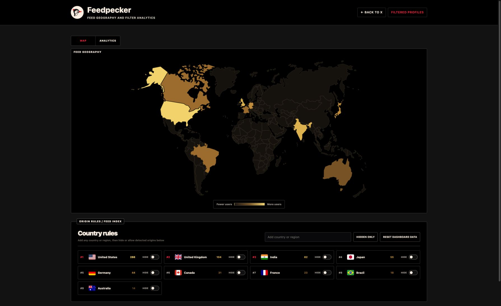

<h1> Feedpecker</h1>

**See where your X feed comes from. Hide what you do not want. Keep the data on your own computer.**

Feedpecker is a local-first browser extension that adds account-location context to X, filters posts by country or region, and visualizes the geography of your feed.

> 🔒 **Private by design:** no telemetry, developer backend, shared account database, or location submissions. Persistent extension data stays in your browser. Network communication is limited to X-owned services needed for account metadata and actions you request, plus a read-only check for this repository's latest public GitHub Release. Flag artwork is bundled locally.

This is an unpacked community build. It is not published in an extension store and is not affiliated with X Corp.

  

## ✨ At a glance

| | Feature |
|---|---|
| 🚩 | Country or region flags beside supported usernames |
| 🕒 | Local time in the flag tooltip when timezone data is available |
| 🙈 | Hide posts from selected countries or regions |
| 👁️ | Per-profile Hide and Unhide controls on X profiles and hover cards |
| 🗺️ | Interactive feed-geography map with hide and allow controls |
| 📈 | Week, month, and year analytics for newly detected filtered profiles |
| 👥 | Searchable, paginated filtered-profile history |
| 🛑 | Optional individual, bulk, and automatic blocking on X |
| 💾 | Manual JSON backup and restore |
| 🔔 | Optional feed warnings for filtering and lookup pacing |
| 🧰 | Local diagnostic logs with rolling 24-hour retention and rate-limit status |

## 🔐 What stays private

Settings, country rules, analytics, logs, filtered-profile history, and cached location results are stored locally using browser extension storage and IndexedDB.

The extension does **not**:

- contact a third-party location service;
- upload discovered usernames or locations;
- use a community or shared profile database;
- send telemetry, diagnostics, or analytics to the developer;
- load executable code from a remote server;
- require an account with this project;
- upload your JSON backups.

### What does leave the browser?

Location detection and account blocking require requests to X using the X session already open in your browser. Flag SVGs are packaged with the extension and do not create network requests. The extension also reads the repository's latest public GitHub Release metadata from `api.github.com` to compare version numbers and show release notes. That request contains no handles, locations, settings, analytics, logs, or backup data.

Firefox describes the X requests as required transmission of website activity and website content in its add-on permission metadata. This data goes only to X for the features described above; it is not sent to this project's developer or any separate backend.

The integration observes X API responses in the page to extract supported account metadata. It does not intentionally extract or store post text, Direct Message text, passwords, or email addresses. Read the complete boundary in [PRIVACY.md](PRIVACY.md).

For the extension's trust model, account-action safeguards, and responsible vulnerability reporting, see [SECURITY.md](SECURITY.md).

## 🚀 Install

### Chrome & Chromium-based Browsers (Brave, Edge, Opera, etc.)

1. Download `feedpecker-v0.6.1.zip` from the latest GitHub Release and extract it. The ZIP itself is already the loadable extension folder—there is no nested `dist` folder. Alternatively, clone this repository and use its committed `dist` folder.
2. Open your browser's extensions page:
   - Chrome: `chrome://extensions`
   - Brave: `brave://extensions`
   - Edge: `edge://extensions`
   - Opera: `opera://extensions`
3. Enable **Developer mode**.
4. Click **Load unpacked**.
5. Select the folder you extracted from the release ZIP. If installing from a repository clone instead, select its `dist` folder.
6. Pin **Feedpecker** from the browser's extension menu.
7. Open or refresh [x.com](https://x.com), then browse normally.

After pulling an update, return to the extensions page and click **Reload** on the extension card.

### Firefox 142 or newer

1. Download and extract `feedpecker-v0.6.1.zip` from the latest GitHub Release, or clone this repository.
2. Open `about:debugging` in Firefox.
3. Select **This Firefox**.
4. Click **Load Temporary Add-on**.
5. Select `manifest.json` from the extracted release folder, or from the committed `dist` folder in a clone.
6. Open or refresh [x.com](https://x.com), then browse normally.

Firefox treats this as a temporary development installation, so it is removed when Firefox restarts. Return to `about:debugging` to load it again or to click **Reload** after updating the files. A persistent Firefox installation would require a package signed by Mozilla.

### Developer note

Users do not need Node.js or npm to install the committed build. If you modify files under `src/` or `assets/`, run `npm run build` before committing so the browser-ready `dist/` folder stays up to date. Maintainers can run `npm run package` to validate the project and create a release ZIP with `manifest.json` at its root.

## 🧭 How location detection works

1. The extension reads useful account metadata already present in X's timeline responses.
2. If a visible profile is not cached and X did not provide enough information, it requests X's account-location metadata.
3. The result is cached locally to avoid repeating the same lookup.
4. A shared local request budget, pacing rules, and X's response headers control cooldowns.
5. Country filters are applied directly in the page.

> ⚠️ X controls its internal APIs and rate limits. Detection may pause temporarily, broad regional labels can be approximate, and future X changes may require extension updates.

### How lookup pacing avoids rate limits

X includes three useful values with account-location responses: the window limit, how many requests remain, and when that window resets. The extension uses those reported values instead of pretending the limit is always a fixed number.

- With more than 20 lookups left, uncached visible profiles are checked at the normal pace of at most one request per second.
- At 20 or fewer, the extension spreads the usable requests across the time remaining in X's current window. For example, if 17 usable requests remain and the reset is 17 minutes away, it allows roughly one request per minute.
- The final three requests are kept as a safety reserve. Location lookups pause until X's reset time instead of deliberately spending the quota down to zero.
- If X still returns an actual `429` response, the extension treats that as authoritative, displays zero remaining, and waits for X's reset timestamp.

Cached results and location metadata already present in X's own timeline responses do not spend this lookup allowance. The popup meter appears once 20 requests remain. Optional top-right notifications announce when adaptive pacing begins and when the reset is about a minute away; the **Feed notifications** toggle disables every feed toast.

If X does not provide usable rate-limit headers, the extension temporarily falls back to a conservative 15-minute local window until authoritative values become available.

## 🎛️ Hiding is not blocking

- **Hide posts:** matching posts disappear from your feed only while the extension is enabled.
- **Filtered profiles:** profiles hidden for the first time are added to your local review list.
- **Profile overrides:** use **Hide** or **Unhide** on a profile page or hover card to override country rules for that handle. Manual Hide works without a location lookup.
- **Block on X:** explicitly blocks a selected profile through X.
- **Auto-block:** automatically blocks matching profiles upon detection. It is **off by default**.

Auto-block and bulk blocking use the same action scheduler. A shared local action budget coordinates open X tabs, while each tab deduplicates pending handles and sends one request about every 2.5 seconds when X reports a healthy allowance. At ten calls remaining the scheduler spreads the usable calls across the rest of X's reported window, preserves the final three as a safety reserve, and stops immediately if X returns `429`.

## 📊 Dashboard and analytics

The dashboard includes:

- an interactive map of countries represented in your feed;
- country-level hide and allow controls;
- week, month, and year views of newly detected filtered profiles;
- scanned-profile and discovered-country totals;
- filtered-profile history and local diagnostic logs.

Analytics count a matching profile when it is newly identified and hidden. Later appearances served from the local cache are hidden again without inflating the new-detection timeline.

## 💾 Backup and restore

Open **Filtered profiles** to manage portable data:

- **Download backup** creates one local JSON file.
- **Restore backup** replaces the extension's portable data with a previous backup.

Backups include settings, country rules, per-profile visibility overrides, analytics, and filtered profiles. Cached location results are included when an active, refreshed X tab can provide them. Without that cache, restored profiles may simply need to be checked again.

> Keep backup files private: they can contain account handles, inferred locations, filter history, and your settings in readable JSON.

## 🛡️ Permissions

| Permission | Why it is used |
|---|---|
| `storage` | Save settings, analytics, profiles, logs, and rate-limit state locally |
| `x.com` / `twitter.com` | Run the feed integration, find an open X tab, and use your authenticated X session |
| `api.github.com` | Read this repository's latest public release version and notes for update notifications |

The extension does not request access to all websites, general tab metadata, browser history, downloads, clipboard contents, or the browser's cookie API.

## 🌱 Built as a local-first tool

Feedpecker is designed around a deliberately narrow boundary: X account metadata is interpreted in the open page, useful results are cached locally, and filtering and analytics happen in your browser. It supports unpacked Chromium and Firefox workflows, viewport-driven lookups, adaptive request pacing, profile management, JSON backup and restore, and an interface built for reviewing—not merely hiding—the geography of a feed.

The bundled map and flag artwork are independently maintained open-source resources. Their required notices are in [THIRD_PARTY_NOTICES.md](THIRD_PARTY_NOTICES.md).

## 🧱 Project structure

Feedpecker keeps editable source, browser-ready output, tests, and documentation separate:

- `src/content/` contains the ordered feed-runtime components rather than one oversized content script;
- `src/ui/` groups the popup, dashboard, and filtered-profile interfaces;
- `src/shared/` contains browser adapters, country data, and backup handling;
- `assets/` contains the source icon and map;
- `scripts/build.mjs` creates the browser-ready `dist/` directory;
- `scripts/package-release.mjs` creates the directly loadable release ZIP;
- `tests/` validates manifest references, JavaScript syntax, and retired-brand cleanup.

Run `npm run check` before loading or publishing a build.

## ⚖️ Disclaimer

This project is for personal customization and educational use. It is not affiliated with, endorsed by, or sponsored by X Corp. X's internal interfaces may change, and automated filtering or blocking should be used responsibly.
